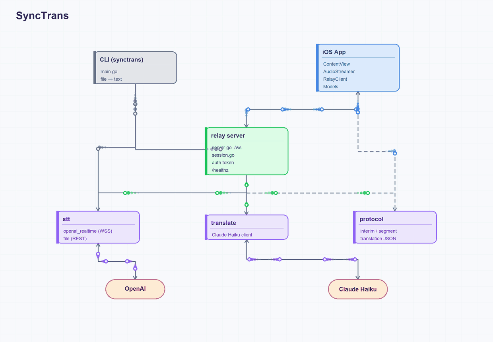

# SyncTrans

Real-time **speech translation relay**. Speak into a phone in one language and get
a live, streaming translation in another — transcription and translation happen
server-side and stream back word-by-word.

The first target pair is **Hebrew → English**, but the pipeline is
language-agnostic (languages are chosen per connection).

## Architecture



*Animated block-scheme — the moving packets show how the components communicate.
An interactive version (pan, zoom, hover to trace calls, click to isolate) lives in
[`schema/graph.html`](schema/graph.html).*

## How it works

```
 iOS app  ──PCM16 audio──▶  relay (Go)  ──▶  OpenAI Realtime  (speech → text)
          ◀──JSON────────               ──▶  Claude Haiku      (text → translation)
```

1. The phone captures mic audio as PCM16 mono @ 16 kHz and streams it up a
   WebSocket (`/ws`).
2. The **relay** feeds the audio to OpenAI's Realtime API for streaming
   transcription, then sends each finalized segment to **Claude Haiku** for
   translation.
3. Interim text, finalized segments, and translations stream back to the phone as
   JSON messages (see [`internal/protocol`](internal/protocol/protocol.go) for the
   wire contract).

## Components

| Path | What it is |
|------|-----------|
| `main.go` | **CLI (Milestone 0)** — transcribe a Hebrew audio file and print the Hebrew + English. Handy for testing the STT + translation legs without a phone. |
| `cmd/relay/` | **Relay server (Milestone 1)** — the WebSocket streaming server. |
| `internal/relay/` | Connection lifecycle: `server` (HTTP/WS + auth) and `session` (per-connection state machine). |
| `internal/stt/` | Speech-to-text: `openai_realtime` (streaming WSS) and `file` (one-shot REST). |
| `internal/translate/` | Translation via the Anthropic (Claude) API. |
| `internal/protocol/` | The JSON message contract shared by relay and clients. |
| `ios/SyncTrans/` | The iOS client (SwiftUI) — audio capture, WebSocket, UI. |

## Configuration

All secrets come from environment variables (nothing is hard-coded):

| Variable | Purpose |
|----------|---------|
| `OPENAI_API_KEY` | Speech-to-text (Realtime + file transcription). **Required.** |
| `ANTHROPIC_API_KEY` | Translation with Claude Haiku. **Required.** |
| `RELAY_AUTH_TOKEN` | Shared token the client must pass as `?token=` on the WS URL. If unset, the relay is **open** — fine for localhost, not for a public deploy. |
| `RELAY_ADDR` / `PORT` | Listen address. `RELAY_ADDR` wins; otherwise `:$PORT`; otherwise `:8080`. |
| `RELAY_CHUNK_MS` | `0` (default) = server-VAD mode (OpenAI detects sentence boundaries); `>0` = fixed-interval chunking. |

## Running

**CLI (transcribe + translate a file):**

```bash
OPENAI_API_KEY=... ANTHROPIC_API_KEY=... go run . sample_he.m4a
```

**Relay server:**

```bash
OPENAI_API_KEY=... ANTHROPIC_API_KEY=... go run ./cmd/relay
# WebSocket endpoint:  ws://localhost:8080/ws
# Health check:        GET /healthz
```

The iOS client lives in [`ios/`](ios/) — open it in Xcode and point it at your
relay host.

## Deployment

The relay ships as a container (see [`Dockerfile`](Dockerfile)) and is configured
for **Fly.io** ([`fly.toml`](fly.toml), app `synctrans-relay`, region `fra`). Set
the API keys and `RELAY_AUTH_TOKEN` as Fly secrets before deploying:

```bash
fly secrets set OPENAI_API_KEY=... ANTHROPIC_API_KEY=... RELAY_AUTH_TOKEN=...
fly deploy
```

## Requirements

- Go 1.25+
- An OpenAI API key and an Anthropic API key
- Xcode (for the iOS client)
